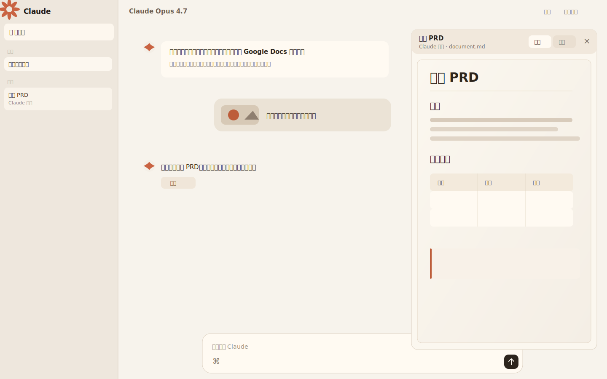

# Lite Claude UI

一个轻量的 Claude 风格文档聊天界面，适合用自己的 OpenAI-compatible API Key 搭建单用户 AI 工作台。它重点复刻 Claude.ai 里最实用的体验：干净的聊天界面、右侧 Artifact / 文档预览、图片输入、文件导入、流式输出和高质量文档生成。

> Unofficial project. This repository is not affiliated with Anthropic or Claude.



## Features

- Claude-like chat layout with a warm paper-style interface.
- Streaming assistant responses with a live output cursor.
- Right-side document / Artifact preview panel.
- Auto-create document previews for long-form writing, reports, drafts and HTML artifacts.
- Closeable document panel that does not fight the user while generation continues.
- Upload images and paste screenshots directly into the composer.
- Sent image thumbnails in the chat history.
- Import `.docx` files exported from Google Docs or Word, preserving headings, lists, tables, links and inline images in the preview.
- Download generated documents as Markdown or HTML.
- Copy assistant replies and generated documents.
- Optional Brave Search integration for web-search-assisted answers.
- Minimal single-user password login.
- Small Node.js runtime footprint, designed for low-memory VPS deployment.
- Experimental Cloudflare Workers entry in `src/worker.js`.

## Stack

- Frontend: plain HTML, CSS and browser JavaScript.
- Backend: Node.js built-in HTTP server.
- Document import: `mammoth`.
- API: OpenAI-compatible `/chat/completions` endpoint.
- Optional search: Brave Search API.

There is no React build step, database, Docker requirement or heavy server framework.

## Quick Start

```bash
git clone https://github.com/piglet12138/lite-claude-ui.git
cd lite-claude-ui
npm install
cp .env.example .env
npm start
```

Open:

```text
http://127.0.0.1:3040
```

Before starting, edit `.env`:

```dotenv
LUCKY_BASE_URL=https://luckyapi.chat/v1
LUCKY_API_KEY=replace_with_your_api_key
MODEL=claude-opus-4-7

ACCESS_EMAIL=admin@example.com
ACCESS_PASSWORD=change-me
SESSION_SECRET=replace_with_a_long_random_string
```

## Environment Variables

| Name | Required | Description |
| --- | --- | --- |
| `PORT` | No | Local listen port. Defaults to `3040`. |
| `LUCKY_BASE_URL` | Yes | OpenAI-compatible API base URL. Example: `https://luckyapi.chat/v1`. |
| `LUCKY_API_KEY` | Yes | API key for the upstream model provider. Never expose this in frontend code. |
| `MODEL` | No | Model name sent to the upstream API. Defaults to `claude-opus-4-7`. |
| `ACCESS_EMAIL` | Yes | Login username / email for the web UI. |
| `ACCESS_PASSWORD` | Yes | Login password for the web UI. |
| `SESSION_SECRET` | Yes | Long random string used to sign the login cookie. |
| `ENABLE_WEB_SEARCH` | No | Set to `true` to enable Brave Search support. |
| `BRAVE_SEARCH_API_KEY` | No | Brave Search API key. Required only when search is enabled. |
| `WEB_SEARCH_RESULT_COUNT` | No | Number of Brave results to include, from 1 to 5. |

## Production Deployment

The app works well behind Nginx and systemd.

Example systemd service:

```ini
[Unit]
Description=Lite Claude UI
After=network.target

[Service]
Type=simple
WorkingDirectory=/opt/lite-claude-ui
EnvironmentFile=/opt/lite-claude-ui/.env
ExecStart=/usr/bin/node server.mjs
Restart=always
RestartSec=3

[Install]
WantedBy=multi-user.target
```

Example Nginx reverse proxy:

```nginx
server {
    listen 443 ssl http2;
    server_name claude.example.com;

    location / {
        proxy_pass http://127.0.0.1:3040;
        proxy_http_version 1.1;
        proxy_set_header Host $host;
        proxy_set_header X-Real-IP $remote_addr;
        proxy_set_header X-Forwarded-For $proxy_add_x_forwarded_for;
        proxy_set_header X-Forwarded-Proto $scheme;

        proxy_buffering off;
        proxy_cache off;
    }
}
```

For streaming responses, keep `proxy_buffering off`.

## Cloudflare Workers

`src/worker.js` and `wrangler.toml` provide an experimental Workers deployment path. The Node server currently has the fuller feature set, especially for `.docx` import and image handling.

Set secrets with Wrangler:

```bash
npx wrangler secret put LUCKY_API_KEY
npx wrangler secret put ACCESS_PASSWORD
npx wrangler secret put SESSION_SECRET
```

Then deploy:

```bash
npx wrangler deploy
```

## Security Notes

- Do not commit `.env`, API keys, production passwords or session secrets.
- This project is designed as a personal or small private tool, not a multi-tenant SaaS authentication system.
- The Artifact preview uses a sandboxed iframe for HTML output, but you should still treat generated code as untrusted.
- Keep the app behind HTTPS in production because login cookies are marked `Secure`.

## Project Structure

```text
.
├── public/
│   ├── app.js
│   ├── index.html
│   ├── logo.svg
│   └── styles.css
├── src/
│   └── worker.js
├── server.mjs
├── wrangler.toml
├── package.json
└── .env.example
```

## Development

Syntax check:

```bash
npm run check
```

Run locally:

```bash
npm start
```

The app intentionally avoids a frontend build pipeline so UI changes can be made directly in `public/`.
